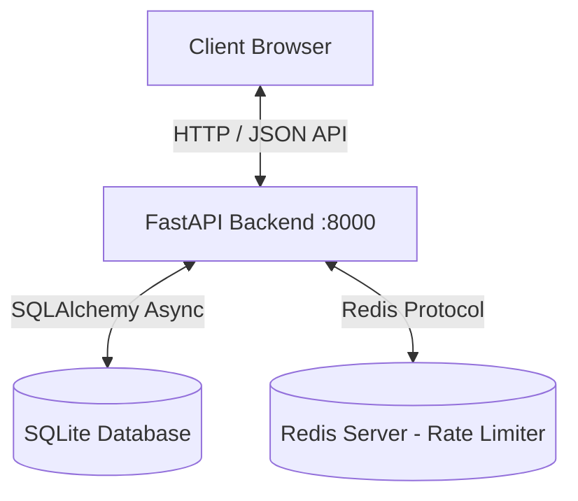

# QR Contact App: Architecture & Integration Guide

Welcome to the QR Contact App! This project is a privacy-preserving QR-based contact system. It allows users to generate QR codes that others can scan to get in touch (via message, call request, or notification alert) without ever exposing the owner's real phone number.

This guide is designed specifically to help you understand the architecture of this app, learn how the **React frontend** integrates with the **FastAPI backend**, and learn how to deploy it.

---

## Table of Contents
1. [System Architecture](#1-system-architecture)
2. [React 101 for Backend Developers](#2-react-101-for-backend-developers)
3. [Step-by-Step Integration Flows](#3-step-by-step-integration-flows)
   - [A. Authentication & Token Storage](#a-authentication--token-storage)
   - [B. QR Code Generation & the Contact Link](#b-qr-code-generation--the-contact-link)
   - [C. The Guest Contact Journey](#c-the-guest-contact-journey)
   - [D. Owner's Messages Dashboard](#d-owners-messages-dashboard)
4. [Local Development Guide](#4-local-development-guide)
5. [FastAPI Serving the React App Statically](#5-fastapi-serving-the-react-app-statically)
6. [Deployment Instructions](#6-deployment-instructions)

---

## 1. System Architecture

The application is split into two clean layers:



*   **Frontend**: A Single Page Application (SPA) built using **React**, **Vite**, and **TypeScript**. It runs entirely in the user's browser. It has no server of its own; it compiles down to standard static files (HTML, CSS, JavaScript).
*   **Backend**: A **FastAPI** web service. It provides a RESTful API at `http://127.0.0.1:8000/api` and handles security, database persistence, rate-limiting, and QR image generation.

---

## 2. React 101 for Backend Developers

If you are coming from a backend background, here is how the frontend code is structured and how it operates.

### A. Client-Side Routing (React Router)
In traditional web apps, clicking a link requests a new HTML page from the server. In a React SPA, **React Router** intercepts URL changes and renders the matching component in the browser *instantly* without reloading.

*   File: [AppRoutes.tsx](file:///c:/coding/backend/fastapi/health_api/qr_app/frontend/src/routes/AppRoutes.tsx)
*   **Routes**:
    *   `/login` and `/signup` render authentication pages.
    *   `/dashboard` (Protected) lists the owner's QR codes and profile.
    *   `/messages` (Protected) lists messages received from QR scans.
    *   `/contact/:uniqueCode` (Public) is the landing page shown when someone scans a QR code. The `:uniqueCode` is a dynamic route parameter representing the scanned code.

### B. The API Client & Interceptors (Axios)
Axios is the HTTP client used to fetch data. We configure a central client instance to communicate with the FastAPI backend.

*   File: [client.ts](file:///c:/coding/backend/fastapi/health_api/qr_app/frontend/src/api/client.ts)
*   **Base URL**: Configured using Vite's environment variable `import.meta.env.VITE_API_BASE_URL` (which defaults to `http://127.0.0.1:8000`).
*   **Request Interceptor**: Before sending any HTTP request, Axios checks if a token is stored in `sessionStorage` (which lives as long as the browser tab is open). If a token exists, it adds the header:
    ```http
    Authorization: Bearer <your_jwt_token>
    ```
*   **Response Interceptor**: If the backend returns a `401 Unauthorized` status (e.g., when the session expires), this interceptor automatically triggers a callback to clear the invalid token and redirect the user back to the login screen.

### C. Server State Management (React Query)
Instead of manually managing loading states, error states, and fetch requests with `useEffect`, the app uses **React Query** (`@tanstack/react-query`).

*   **Queries (`useQuery`)**: Used to fetch data. It caches responses, manages loading/error indicators, and handles automatic updates (polling).
    *   *Example (from [MessagesPage.tsx](file:///c:/coding/backend/fastapi/health_api/qr_app/frontend/src/pages/MessagesPage.tsx))*:
        ```typescript
        const { data: messages, isLoading, error } = useQuery({
          queryKey: ['messages'],
          queryFn: getMessages,      // Fetches messages from /api/messages
          refetchInterval: 30000,    // Polls the server every 30 seconds for new messages!
        })
        ```
*   **Mutations (`useMutation`)**: Used to perform write operations (POST, PATCH, DELETE) that modify data.
    *   *Example (from [DashboardPage.tsx](file:///c:/coding/backend/fastapi/health_api/qr_app/frontend/src/pages/DashboardPage.tsx))*:
        ```typescript
        const deleteMutation = useMutation({
          mutationFn: deleteQRCode,  // Calls DELETE /api/qr-codes/{id}
          onSuccess: () => {
            // Re-fetch the updated list of QR codes
            queryClient.invalidateQueries({ queryKey: ['qr-codes'] })
            showToast('QR code deactivated', 'success')
          }
        })
        ```

### D. Global State (Context API)
React components pass data down via properties ("props"). For data needed globally (like user auth status or UI theme), we use **Context**.
*   [AuthContext.tsx](file:///c:/coding/backend/fastapi/health_api/qr_app/frontend/src/context/AuthContext.tsx): Manages the logged-in user profile, handles `login`/`signup`/`logout` actions, and saves/removes the token from `sessionStorage`.
*   [ThemeContext.tsx](file:///c:/coding/backend/fastapi/health_api/qr_app/frontend/src/context/ThemeContext.tsx): Tracks light/dark mode preference and stores it in `sessionStorage` (per session).

---

## 3. Step-by-Step Integration Flows

### A. Authentication & Token Storage
```
[React Frontend]                              [FastAPI Backend]
   |                                               |
   |-- POST /api/auth/login (username, password) ->|
   |   (Axios logs in user)                        |
   |                                               |-- Verifies credentials
   |<-- Response: { access_token: "JWT_TOKEN" } ---|
   |
   |-- setStoredToken("JWT_TOKEN") in sessionStorage
   |-- Redirects to /dashboard
```

### B. QR Code Generation & the Contact Link
How does the contact link work?
1.  The backend needs to know the address of the frontend application so that QR codes direct scanners to the client-side `/contact/:uniqueCode` route rather than a backend endpoint.
2.  We configure this using the `FRONTEND_URL` settings in the backend (e.g. `http://localhost:5173` in development, or the production URL like `http://127.0.0.1:8000`).
3.  In [qr_route.py](file:///c:/coding/backend/fastapi/health_api/qr_app/api/qr_route.py):
    ```python
    frontend_url = settings.FRONTEND_URL.rstrip("/")
    contact_url = f"{frontend_url}/contact/{qr.public_code}"
    
    # Generate the physical QR image containing this contact_url
    qr_img = qrcode.make(contact_url)
    ```
4.  The backend generates a QR image containing this link, converts it to a base64 Data URL, and returns it to the frontend.
5.  The frontend displays the image and the text link `contact_url` on the dashboard.

### C. The Guest Contact Journey
When a visitor scans the QR code or clicks the contact link:
```
[Guest Browser]                              [React Frontend]                            [FastAPI Backend]
       |                                             |                                           |
       |-- Visits /contact/{uniqueCode} ------------>|                                           |
       |   (React Router renders ContactPage)        |                                           |
       |                                             |-- GET /api/contact/{uniqueCode} --------->|
       |                                             |   (Validates code & increments scan count)|
       |                                             |<-- Response: { options: ["call", ...] } --|
       |                                             |
       |-- Fills form & clicks "Send Message" ------>|
       |                                             |-- POST /api/contact/{uniqueCode}/message -|
       |                                             |   Header: idempotent_key: "random-uuid"   |
       |                                             |   Payload: { message: "Hello!" }          |
       |                                             |                                           |-- Stores message in DB
       |                                             |<-- Response: { message: "Message sent" } -|
       |                                             |
       |<-- Shows Toast: "Message sent successfully" -|
```

> [!NOTE]
> **Idempotency Key**: To prevent users from accidentally sending double messages or initiating multiple calls if they double-click a button, the React frontend generates a unique key (UUID) for each action. The FastAPI backend ensures that if it receives the same key twice for a specific code, it skips creating a duplicate entry in the database.

### D. Owner's Messages Dashboard
The owner log in and navigates to the messages tab.
1.  The frontend calls `GET /api/messages` to get the list of messages sent to their QR codes.
2.  The frontend displays the messages in a list, showing status, sender name, message content, and timestamp.
3.  The owner can click **Mark as Read**, which calls `PATCH /api/messages/{id}/read` to update the status in the database.
4.  React Query refreshes this page automatically every 30 seconds (`refetchInterval: 30000`) so the owner sees new messages in real-time without reloading!

---

## 4. Local Development Guide

To run frontend and backend as separate dev processes (highly recommended for coding):

### 1. Start the FastAPI Backend
```bash
# Navigate to project root
python -m venv .venv
.venv\Scripts\activate
pip install -r requirements.txt

# Create .env and set FRONTEND_URL to the Vite dev server URL
# Edit .env:
# FRONTEND_URL=http://localhost:5173

# Run the backend
uvicorn main:app --reload --port 8000
```
*Backend URL*: `http://127.0.0.1:8000`  
*Interactive Docs*: `http://127.0.0.1:8000/docs`

### 2. Start the React Frontend
```bash
# Open a new terminal and navigate to the frontend directory
cd frontend
npm install

# Ensure VITE_API_BASE_URL points to the backend
# Edit frontend/.env:
# VITE_API_BASE_URL=http://127.0.0.1:8000

# Start Vite server
npm run dev
```
*Frontend URL*: `http://localhost:5173`

---

## 5. FastAPI Serving the React App Statically

For ease of testing or deployment, you can configure the FastAPI backend to serve the React app directly. This allows running the entire system on a single port (`8000`) without running a separate Node/Vite server!

### How it is configured in [main.py](file:///c:/coding/backend/fastapi/health_api/qr_app/main.py):
1.  **Build the React frontend**: Run `npm run build` in the `frontend` folder. This compiles the React code and outputs files to `frontend/dist`.
2.  **Mount `/assets`**: Static CSS and JS assets are served using FastAPI's `StaticFiles`.
3.  **Fallback Route**: Any URL path that doesn't match backend endpoints (like `/api/...` or `/health`) or static files in the build folder is caught by the `/{catchall:path}` route, which returns `frontend/dist/index.html`. This lets the React frontend router handle pages correctly.

### Run with Frontend Included:
1.  Build the frontend:
    ```bash
    cd frontend
    npm run build
    cd ..
    ```
2.  Update backend `.env` to point the `FRONTEND_URL` to port 8000:
    ```env
    FRONTEND_URL=http://127.0.0.1:8000
    ```
3.  Run only the FastAPI backend:
    ```bash
    uvicorn main:app --reload --port 8000
    ```
4.  Open `http://127.0.0.1:8000` in your browser. The entire application (dashboard, login, QR generation, guest contact page) is served from port 8000!

---

## 6. Deployment Instructions

### Option A: Single Server Deployment (Recommended)
This method hosts both the backend and frontend on a single server, making it extremely easy to manage.

1.  **Prepare the Frontend Build**:
    Run `npm run build` in the `frontend` folder. Ensure that the built files are generated inside `frontend/dist`.
2.  **Configure Environment Variables**:
    On your hosting platform, set the following environment variables:
    ```env
    DATABASE_URL=sqlite+aiosqlite:///./data/qr_app.db   # Or PostgreSQL URL
    SECRET_KEY=highly-secure-random-secret-key-here
    FRONTEND_URL=https://your-production-domain.com
    CORS_ORIGINS=https://your-production-domain.com
    REDIS_ENABLED=false                                 # Or true if Redis is available
    ```
3.  **Run Backend with a Production Server**:
    Deploy the backend repository to your host (e.g. Render, Railway, Fly.io, or VPS) and run:
    ```bash
    uvicorn main:app --host 0.0.0.0 --port 8080
    ```
    (Replace `8080` with the port requested by your host environment).

---

### Option B: Decoupled Deployment (Split Domains)
This approach deploys the frontend and backend separately, which is ideal if you want to use dedicated static hosting for the React frontend (like Vercel or Netlify) and dynamic hosting for the FastAPI backend.

#### 1. Backend (e.g., Render / Fly.io)
*   **Environment Settings**:
    ```env
    DATABASE_URL=sqlite+aiosqlite:///./data/qr_app.db
    FRONTEND_URL=https://my-qr-frontend.vercel.app      # Must point to your frontend domain!
    CORS_ORIGINS=https://my-qr-frontend.vercel.app      # Allow frontend to query the API
    ```
*   **Startup command**:
    ```bash
    uvicorn main:app --host 0.0.0.0 --port 8080
    ```

#### 2. Frontend (e.g., Vercel / Netlify)
*   **Build Settings**:
    *   Build Command: `npm run build`
    *   Output Directory: `dist`
*   **Environment Variables**:
    *   `VITE_API_BASE_URL=https://my-qr-backend.onrender.com` (Point to your deployed backend URL).
*   **Single Page Application Routing Configuration**:
    Because it's a React SPA, page routes like `/contact/:code` need to be redirected to `index.html` by the static host.
    *   **For Vercel (`vercel.json` in the root of `frontend`):**
        ```json
        {
          "rewrites": [
            { "source": "/(.*)", "destination": "/index.html" }
          ]
        }
        ```
    *   **For Netlify (`_redirects` inside `frontend/public/`):**
        ```text
        /*  /index.html  200
        ```
